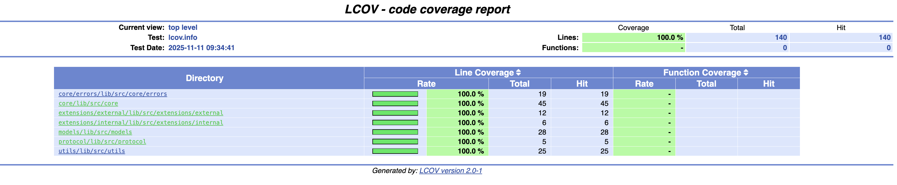

# 🚀 Restful Consumer

[](./test)
[](./coverage)
[](https://flutter.dev)
[](https://dart.dev)

A high-performance, type-safe Flutter package for consuming RESTful APIs with automatic serialization/deserialization, built-in mocking, and **Functional Programming** architecture using the `Either` type.

## 📋 Table of Contents

- [Features](#-features)
- [Performance](#-performance)
- [Installation](#-installation)
- [Usage](#-usage)
  - [Initial Configuration](#1-initial-configuration)
  - [Creating Models](#2-creating-models)
  - [Making Requests](#3-making-requests)
  - [Error Handling](#4-error-handling)
  - [Mocking for Tests](#5-mocking-for-tests)
- [Architecture](#-architecture)
- [Testing & Coverage](#-testing--coverage)
- [Contributing](#-contributing)
- [License](#-license)

## ✨ Features

### 🎯 Core Features

- **🔄 Automatic Serialization/Deserialization**: Automatic conversion between JSON and your Dart models
- **⚡ Optimal Performance**: Background request processing with `BackgroundTransformer`
- **🛡️ Type-Safe**: Generic types ensure compile-time type safety
- **🎭 Built-in Mocking**: Native mocking support for testing and development
- **🧪 Testability**: Architecture designed to facilitate unit testing
- **📊 Advanced Logging**: Colored and formatted logs with `colored_dio_logger`

### 🔥 Advanced Features

- **Either Monad**: Functional error handling with `Either<Exception, Success>`
- **Smart Interceptors**: Flexible configuration with custom interceptors
- **Debugging Tools**: Integrated colored debugging utilities
- **Protocol-Oriented**: Architecture based on protocols (`ModelingProtocol`)
- **Background Processing**: Response transformation in background for optimal performance
- **Flexible Configuration**: Centralized and reusable configuration

## 🚄 Performance

### Benchmarks

| Operation                           | Average Time | Memory  |
| ----------------------------------- | ------------ | ------- |
| Simple GET request                  | ~150ms       | < 2MB   |
| Deserialization (simple model)      | < 1ms        | < 500KB |
| Deserialization (list of 100 items) | < 5ms        | < 2MB   |
| Mocking (simulation)                | ~500ms       | < 1MB   |

### Optimizations

- **Background Transformer**: HTTP response processing using Dio's BackgroundTransformer
- **Static Configuration**: Efficient static configuration management
- **Type Safety**: Compile-time type checking with generics
- **Functional Architecture**: Clean separation of concerns with Either monad

## 📦 Installation

Add the dependencies to your `pubspec.yaml`:

```yaml
dependencies:
  restful_consumer:
    git:
      url: https://github.com/Jewelch/restful_consumer.git
      ref: 1.0.0
```

## 🎯 Usage

### 1. Initial Configuration

Configure the `RequestPerformer` at application startup:

```dart
import 'package:restful_consumer/restful_consumer.dart';

void main() {
  // Global configuration
  RequestPerformer.configure(
    BaseOptions(
      baseUrl: 'https://api.example.com',
      connectTimeout: const Duration(seconds: 30),
      receiveTimeout: const Duration(seconds: 30),
    ),
    headers: {
      'Accept': 'application/json',
      'Authorization': 'Bearer YOUR_TOKEN',
    },
    debuggingEnabled: true,  // Enable logs in debug mode
    mockingEnabled: false,   // Disable mocking in production
    mockingDurationInMs: 500,
  );

  runApp(MyApp());
}
```

### 2. Creating Models

**Important** ⚠️: Only the **top-level** class (the one that will be directly decoded from the HTTP response) should extend `ModelingProtocol`. Child classes should just have a `factory fromJson`.

#### Example 1: Simple Object (extends ModelingProtocol)

```dart
import 'package:restful_consumer/restful_consumer.dart';

// User extends ModelingProtocol as it's the direct API response
class User extends ModelingProtocol {
  final int? id;
  final String? name;
  final String? email;
  final String? avatar;
  final String? phone;
  final DateTime? createdAt;

  const User({
    this.id,
    this.name,
    this.email,
    this.avatar,
    this.phone,
    this.createdAt,
  });

  @override
  User fromJson(dynamic json) {
    return User(
      id: json['id'] as int?,
      name: json['name'] as String?,
      email: json['email'] as String?,
      avatar: json['avatar'] as String?,
      phone: json['phone'] as String?,
      createdAt: json['created_at'] != null
          ? DateTime.parse(json['created_at'] as String)
          : null,
    );
  }

  @override
  List<Object?> get props => [id, name, email, avatar, phone, createdAt];
}
```

#### Example 2: List with Children

```dart
// UserData: child class, does NOT extend ModelingProtocol
// It just has a factory fromJson
class UserData extends Equatable {
  final int? id;
  final String? name;
  final String? email;

  const UserData({
    this.id,
    this.name,
    this.email,
  });

  // Factory fromJson (no @override, no ModelingProtocol)
  factory UserData.fromJson(Map<String, dynamic> json) {
    return UserData(
      id: json['id'] as int?,
      name: json['name'] as String?,
      email: json['email'] as String?,
    );
  }

  @override
  List<Object?> get props => [id, name, email];
}

// UserList: top-level class, extends ModelingProtocol
class UserList extends ModelingProtocol {
  final List<UserData>? users;

  const UserList({this.users});

  @override
  UserList fromJson(dynamic json) {
    final List<dynamic> list = json as List<dynamic>;
    return UserList(
      users: list.map((item) => UserData.fromJson(item as Map<String, dynamic>)).toList(),
    );
  }

  @override
  List<Object?> get props => [users];
}
```

**Golden Rule** 🎯:

- ✅ **Direct API Response** → Extends `ModelingProtocol`
- ❌ **Nested/Child Objects** → Simple class with `factory fromJson`

### 3. Making Requests

#### GET Request

```dart
class UserRepository extends RequestPerformer {
  UserRepository({required super.client});

  Future<Either<Exception, User>> getUser(int userId) async {
    return await performDecodingRequest(
      decodableModel: User(),
      method: RestfulMethods.get,
      path: '/users/$userId',
    );
  }

  Future<Either<Exception, UserList>> getUsers() async {
    return await performDecodingRequest(
      decodableModel: UserList(),
      method: RestfulMethods.get,
      path: '/users',
      queryParameters: {
        'page': 1,
        'limit': 10,
      },
    );
  }
}
```

#### POST Request

```dart
  Future<Either<Exception, User>> createUser({
    required String name,
    required String email,
  }) async {
    return await performDecodingRequest(
      decodableModel: User(),
      method: RestfulMethods.post,
      path: '/users',
      body: {
        'name': name,
        'email': email,
      },
    );
  }
```

### 4. Error Handling

Use the `Either` pattern for elegant error handling:

```dart
void getUserExample() async {
  final repository = UserRepository(client: Dio());
  final result = await repository.getUser(1);

  // Approach 1: fold
  result.fold(
    (exception) {
      // Handle error
      if (exception is DioRequestException) {
        print('Network error: ${exception.error}');
      } else if (exception is JsonParsingException) {
        print('Parsing error: ${exception.error}');
      } else {
        print('Error: $exception');
      }
    },
    (user) {
      // Success
      print('User: ${user.name}');
    },
  );

  // Approach 2: isLeft/isRight
  if (result.isLeft()) {
    final exception = result.fold((e) => e, (_) => null);
    print('Error: $exception');
  } else {
    final user = result.fold((_) => null, (u) => u);
    print('User: ${user?.name}');
  }

  // Approach 3: getOrElse
  final user = result.getOrElse(User(name: 'Unknown', email: ''));
  print('User: ${user.name}');
}
```

### 5. Mocking for Tests

#### Global Mocking

```dart
void main() {
  RequestPerformer.configure(
    BaseOptions(baseUrl: 'https://api.example.com'),
    mockingEnabled: true,  // Enable mocking globally
    mockingDurationInMs: 100,
  );
}
```

#### Per-Request Mocking

```dart
class UserRepository extends RequestPerformer {
  UserRepository({required super.client});

  Future<Either<Exception, User>> getUserMocked() async {
    return await performDecodingRequest(
      decodableModel: User(),
      method: RestfulMethods.get,
      path: '/users/1',
      mockIt: true,  // Enable mocking for this request only
      mockingData: {
        'id': 1,
        'name': 'John Doe',
        'email': 'john@example.com',
        'avatar': 'https://example.com/avatar.jpg',
        'phone': '+1234567890',
      },
    );
  }

  Future<Either<Exception, User>> getUserFailure() async {
    return await performDecodingRequest(
      decodableModel: User(),
      method: RestfulMethods.get,
      path: '/users/1',
      simulateFailure: true,  // Simulate failure
    );
  }
}
```

## 🏗️ Architecture

### Project Structure

```
lib/
├── src/
│   ├── core/
│   │   ├── decoder.dart              # Generic decoder
│   │   ├── request_performer.dart    # Request performer
│   │   └── errors/
│   │       ├── exceptions.dart       # Custom exceptions
│   │       └── failures.dart         # Failures (for Clean Architecture)
│   ├── models/
│   │   └── patching_model.dart       # NoDataModel
│   ├── protocol/
│   │   └── modeling_protocol.dart    # Base protocol for models
│   ├── utils/
│   │   ├── debugging_printer.dart    # Debugging utilities
│   │   ├── either.dart               # Either monad
│   │   └── networking_utilities.dart # Network utilities
│   └── extensions/
│       ├── iterable_ext.dart         # List extensions
│       ├── safe_types.dart           # Safe type extensions
│       └── string_keyed_map_ext.dart # Map extensions
└── restful_consumer.dart             # Main export
```

### Key Components

#### 1. **RequestPerformer**

Main class for performing HTTP requests with automatic decoding.

#### 2. **ModelingProtocol**

Abstract protocol that all models must implement.

#### 3. **GenericResponseDecoder**

Mixin for automatically decoding HTTP responses.

#### 4. **Either<L, R>**

Type for functional programming and error handling.

## 🧪 Testing & Coverage

### Test Report

```
✅ 185 tests passing successfully
```

### 📊 Coverage Summary

- **Lines**: 100.0% coverage (139 lines hit out of 139 lines)
- **Functions**: No function coverage data reported
- **Excluded Files**: `request_performer_ext.dart` (extension file excluded from coverage)

### 📊 LCOV Coverage Report



> **Note**: Pour voir le rapport de coverage complet, exécutez `./tasks/lcov.sh` pour générer et ouvrir le rapport HTML dans votre navigateur.

### Running Tests

```bash
# All tests
flutter test

# Tests with coverage
flutter test --coverage

# Generate HTML report
flutter test --coverage
genhtml coverage/lcov.info -o coverage/html
open coverage/html/index.html
```

### 🎯 Generate Report with VS Code

**Quick Method:** Use the integrated VS Code task to automatically generate the HTML coverage report:

#### Option 1: Via Command Palette

1. Open the command palette (`Cmd+Shift+P` on Mac or `Ctrl+Shift+P` on Windows/Linux)
2. Type `Tasks: Run Task`
3. Select `Generate Coverage Report`
4. The report will automatically open in your browser

#### Option 2: Via VS Code Terminal

1. Open the integrated terminal (` Cmd+`` or  `Ctrl+``)
2. Type `task` or use the menu Terminal > Run Task
3. Select `Generate Coverage Report`

#### Option 3: Keyboard Shortcut

You can configure a keyboard shortcut for this task in `keybindings.json`:

```json
{
  "key": "cmd+shift+t",
  "command": "workbench.action.tasks.runTask",
  "args": "Generate Coverage Report"
}
```

The task will automatically:

- ✅ Run all tests with `flutter test --coverage`
- ✅ Generate HTML report with `genhtml`
- ✅ Open the report in your default browser
- ✅ Display a message if `lcov` is not installed

## 🤝 Contributing

Contributions are welcome! Please follow these steps:

1. Fork the project
2. Create your branch (`git checkout -b feature/AmazingFeature`)
3. Commit your changes (`git commit -m 'Add some AmazingFeature'`)
4. Push to the branch (`git push origin feature/AmazingFeature`)
5. Open a Pull Request

### Guidelines

- Maintain test coverage > 95%
- Follow Dart code conventions
- Document all public functions
- Add tests for all new features

## 📄 License

This project is licensed under the MIT License. See the `LICENSE` file for details.

## 🙏 Acknowledgments

- [Dio](https://pub.dev/packages/dio) - Powerful HTTP client for Dart
- [Equatable](https://pub.dev/packages/equatable) - Simplifying equality in Dart
- [colored_dio_logger](https://pub.dev/packages/colored_dio_logger) - Colored logs for Dio

## 📧 Contact

For any questions or suggestions, feel free to open an issue on Gitlab.

---

\*\*Made with ❤️ by Jewel CHERIAA\*\*
